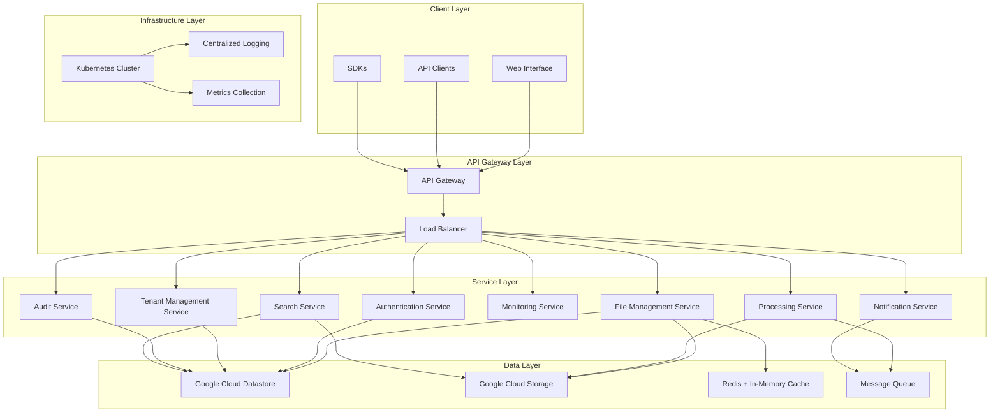

# Design Document

## Overview

The Cloud-native File Operations Platform is designed as a modern, microservices-based system that leverages cutting-edge cloud-native technologies to provide enterprise-grade, scalable, secure, and efficient file management capabilities. The platform follows a distributed architecture pattern with clear separation of concerns, enabling independent scaling, deployment, and evolution of different components while maintaining system cohesion.

The system is built around the principles of:
- **Scalability**: Horizontal scaling capabilities using container orchestration with auto-scaling based on custom metrics
- **Resilience**: Fault-tolerant design with circuit breakers, bulkheads, retry mechanisms, and chaos engineering practices
- **Security**: Zero-trust security model with encryption at rest and in transit, comprehensive RBAC, and threat detection
- **Observability**: Comprehensive monitoring, logging, distributed tracing, and real-time alerting with SLI/SLO tracking
- **Developer Experience**: Well-documented APIs, multi-language SDKs, and comprehensive developer tooling
- **Multi-tenancy**: Complete tenant isolation with customizable configurations and independent scaling
- **Compliance**: Built-in compliance features for GDPR, HIPAA, SOC 2, and other regulatory frameworks
- **Event-Driven Architecture**: Asynchronous processing with event sourcing and CQRS patterns

## Architecture

### High-Level Architecture



### Service Architecture Pattern

The platform follows a microservices architecture with the following key patterns:
- **API Gateway Pattern**: Single entry point for all client requests
- **Database per Service**: Each service owns its data
- **Event-Driven Architecture**: Asynchronous communication via message queues
- **CQRS**: Command Query Responsibility Segregation for read/write operations
- **Circuit Breaker**: Fault tolerance and resilience

## Components and Interfaces

### 1. API Gateway Service

**Purpose**: Central entry point for all API requests, handling routing, authentication, rate limiting, and request/response transformation.

**Key Features**:
- Request routing and load balancing
- Authentication and authorization
- Rate limiting and throttling
- Request/response logging
- API versioning support

**Technology Stack**: Kong/Istio Gateway, Redis for rate limiting

**Interfaces**:
- REST API endpoints
- WebSocket connections for real-time updates
- Health check endpoints

### 2. Authentication Service

**Purpose**: Manages user authentication, authorization, and access control across the platform.

**Key Features**:
- Multi-factor authentication (MFA)
- Role-based access control (RBAC)
- JWT token management
- OAuth2/OpenID Connect integration
- Session management

**Technology Stack**: Node.js/Go, Google Cloud Datastore, Redis + In-Memory Cache

**Interfaces**:
```yaml
POST /auth/login
POST /auth/logout
POST /auth/refresh
GET /auth/profile
PUT /auth/profile
POST /auth/mfa/setup
POST /auth/mfa/verify
```

### 3. File Management Service

**Purpose**: Core service handling file upload, download, storage, and metadata management.

**Key Features**:
- Multipart file upload with resumable capability
- File validation and virus scanning
- Metadata extraction and indexing
- File versioning and lifecycle management
- Secure download link generation

**Technology Stack**: Go/Java Spring Boot, Google Cloud Datastore, Redis + In-Memory Cache

**Interfaces**:
```yaml
POST /files/upload
GET /files/{fileId}
DELETE /files/{fileId}
GET /files/{fileId}/download
POST /files/{fileId}/share
GET /files/search
PUT /files/{fileId}/metadata
```

### 4. Processing Service

**Purpose**: Handles file processing, transformation, and analysis tasks.

**Key Features**:
- Asynchronous file processing
- Multiple processing pipelines
- Batch processing capabilities
- Progress tracking and notifications
- Error handling and retry mechanisms

**Technology Stack**: Python/Go, Celery/RQ, Redis/RabbitMQ

**Interfaces**:
```yaml
POST /processing/jobs
GET /processing/jobs/{jobId}
GET /processing/jobs/{jobId}/status
POST /processing/jobs/{jobId}/cancel
GET /processing/jobs
```

### 5. Notification Service

**Purpose**: Manages notifications and real-time updates to users and external systems.

**Key Features**:
- Multi-channel notifications (email, SMS, webhook)
- Real-time WebSocket connections
- Event-driven notifications
- Notification templates and preferences
- Delivery tracking and retry logic

**Technology Stack**: Node.js, Redis, WebSocket

**Interfaces**:
```yaml
POST /notifications/send
GET /notifications/preferences
PUT /notifications/preferences
WebSocket: /ws/notifications
```

### 6. Monitoring Service

**Purpose**: Provides system monitoring, metrics collection, and alerting capabilities.

**Key Features**:
- Real-time metrics collection
- Custom dashboards and alerts
- Performance monitoring
- Security event tracking
- Audit trail management

**Technology Stack**: Prometheus, Grafana, ELK Stack

### 7. Tenant Management Service

**Purpose**: Manages multi-tenant capabilities including tenant onboarding, configuration, and resource isolation.

**Key Features**:
- Tenant provisioning and deprovisioning
- Tenant-specific configuration management
- Resource quota and usage tracking
- Tenant isolation enforcement
- Custom branding and UI customization

**Technology Stack**: Go/Java Spring Boot, Google Cloud Datastore, Redis + In-Memory Cache

**Interfaces**:
```yaml
POST /tenants
GET /tenants/{tenantId}
PUT /tenants/{tenantId}
DELETE /tenants/{tenantId}
GET /tenants/{tenantId}/usage
PUT /tenants/{tenantId}/config
```

### 8. Audit Service

**Purpose**: Provides comprehensive audit logging, compliance reporting, and forensic capabilities.

**Key Features**:
- Immutable audit trail with cryptographic integrity
- Compliance report generation
- Data lineage tracking
- Forensic analysis capabilities
- Automated compliance monitoring

**Technology Stack**: Go, Google Cloud Datastore, Elasticsearch

**Interfaces**:
```yaml
POST /audit/events
GET /audit/events
GET /audit/reports/{type}
POST /audit/reports/generate
GET /audit/compliance/{framework}
```

### 9. Search Service

**Purpose**: Provides advanced search and indexing capabilities for files and metadata.

**Key Features**:
- Full-text search across file content
- Metadata-based search and filtering
- Advanced query capabilities
- Search result ranking and relevance
- Real-time indexing

**Technology Stack**: Elasticsearch, Go/Python

### 10. Backup and Recovery Service

**Purpose**: Manages automated backups, disaster recovery, and data replication for resilience.

**Key Features**:
- Incremental backups with retention policies
- Cross-region replication for disaster recovery
- Point-in-time restoration with RTO/RPO compliance
- Backup integrity verification and alerts

**Technology Stack**: Go, Google Cloud Datastore, Google Cloud Storage APIs

**Interfaces**:
```yaml
POST /backup/create
GET /backup/{backupId}
POST /recovery/initiate
GET /recovery/status
```

### 11. Integrity Validation Service

**Purpose**: Ensures data integrity through checksums and validation across operations.

**Key Features**:
- SHA-256 checksum computation and storage
- Integrity checks on upload/download/processing
- Quarantine for corrupted files with alerts

**Technology Stack**: Go, Redis for checksum caching

### 12. Performance Optimization Service

**Purpose**: Enhances performance via caching, compression, and load balancing.

**Key Features**:
- Intelligent caching with CDN integration
- File compression (e.g., gzip) for transfers
- Connection pooling and auto-tuning for bottlenecks

**Technology Stack**: Redis, Nginx, Prometheus

### 13. User Lifecycle Management Service

**Purpose**: Handles user onboarding, permissions, and lifecycle events.

**Key Features**:
- Automated provisioning and deprovisioning
- Real-time permission updates and delegation
- Access anomaly detection and account locking

**Technology Stack**: Go, Google Cloud Datastore, LDAP integration

### 14. Integration Service

**Purpose**: Facilitates external integrations via webhooks and connectors.

**Key Features**:
- Webhook notifications for events
- SDKs and connectors for platforms like Slack/Zapier
- Bulk import/export in standardized formats

**Technology Stack**: Node.js, Webhook APIs

### 15. Testing and QA Service

**Purpose**: Supports automated testing and chaos engineering.

**Key Features**:
- Automated unit/integration/E2E tests
- Chaos simulation and recovery measurement
- Load/security testing integration

**Technology Stack**: Jenkins, K6, OWASP ZAP

### Updated Architecture Diagram

```mermaid
graph TB
    ... (existing diagram)
    BACKUP[Backup Service]
    INTEGRITY[Integrity Service]
    PERF[Performance Service]
    USERMGT[User Management Service]
    INTEGRATE[Integration Service]
    QA[Testing Service]
    
    LB --> BACKUP
    LB --> INTEGRITY
    LB --> PERF
    LB --> USERMGT
    LB --> INTEGRATE
    LB --> QA
    
    FILE --> INTEGRITY
    PROC --> BACKUP
    AUTH --> USERMGT
    NOTIF --> INTEGRATE
    MONITOR --> QA
```

## Data Models

### File Entity (Cloud Datastore Kind)
```json
{
  "kind": "File",
  "id": "string",
  "name": "string",
  "size": "number",
  "contentType": "string",
  "checksum": "string",
  "uploadedAt": "timestamp",
  "uploadedBy": "string",
  "status": "string",
  "metadata": {
    "tags": ["string"],
    "description": "string",
    "customFields": "object"
  },
  "storage": {
    "bucket": "string",
    "key": "string",
    "region": "string"
  },
  "access": {
    "visibility": "string",
    "permissions": ["string"],
    "sharedWith": ["string"]
  }
}
```

### User Entity (Cloud Datastore Kind)
```json
{
  "kind": "User",
  "id": "string",
  "email": "string",
  "name": "string",
  "roles": ["string"],
  "preferences": {
    "notifications": "object",
    "ui": "object"
  },
  "createdAt": "timestamp",
  "lastLoginAt": "timestamp",
  "status": "string"
}
```

### Processing Job Entity (Cloud Datastore Kind)
```json
{
  "kind": "ProcessingJob",
  "id": "string",
  "fileId": "string",
  "type": "string",
  "status": "string",
  "progress": "number",
  "result": "object",
  "error": "string",
  "createdAt": "timestamp",
  "completedAt": "timestamp",
  "parameters": "object"
}
```

## Error Handling

### Error Response Format
```json
{
  "error": {
    "code": "string",
    "message": "string",
    "details": "object",
    "timestamp": "timestamp",
    "requestId": "string"
  }
}
```

### Error Categories
- **4xx Client Errors**: Invalid requests, authentication failures, authorization errors
- **5xx Server Errors**: Internal server errors, service unavailable, timeout errors
- **Custom Business Errors**: File size exceeded, unsupported format, quota exceeded

### Retry Strategy
- Exponential backoff for transient failures
- Circuit breaker pattern for service failures
- Dead letter queues for failed message processing
- Graceful degradation for non-critical services

## Testing Strategy

### Unit Testing
- Service-level unit tests with 80%+ code coverage
- Mock external dependencies
- Test business logic and edge cases
- Automated test execution in CI/CD pipeline

### Integration Testing
- API endpoint testing with real database
- Service-to-service communication testing
- Message queue integration testing
- External service integration testing

### End-to-End Testing
- Complete user workflow testing
- Cross-service transaction testing
- Performance and load testing
- Security and penetration testing

### Testing Tools
- **Unit Tests**: Jest (Node.js), Go Test (Go), pytest (Python)
- **Integration Tests**: Postman/Newman, REST Assured
- **E2E Tests**: Cypress, Selenium
- **Load Tests**: K6, JMeter
- **Security Tests**: OWASP ZAP, SonarQube

## Security Considerations

### Authentication & Authorization
- JWT-based authentication with refresh tokens
- Role-based access control (RBAC)
- Multi-factor authentication (MFA)
- OAuth2/OpenID Connect integration

### Data Protection
- Encryption at rest using AES-256
- Encryption in transit using TLS 1.3
- Key management using cloud KMS
- Data anonymization for analytics

### Network Security
- API Gateway with rate limiting
- Web Application Firewall (WAF)
- Network segmentation and VPC
- DDoS protection

### Compliance
- GDPR compliance for data privacy
- SOC 2 Type II certification
- Regular security audits and penetration testing
- Vulnerability scanning and management

## Deployment Architecture

### Google Cloud App Engine Strategy
- Google Cloud App Engine for serverless application deployment
- Standard or Flexible environment based on service requirements
- Automatic scaling and load balancing provided by App Engine
- Integration with Google Cloud services for databases and storage
- Zero-downtime deployments with versioning and traffic splitting

#### Infrastructure as Code
- Use Google Cloud Deployment Manager or Terraform for resource provisioning
- Environment-specific configurations for dev, staging, and prod
- Automated infrastructure testing and validation